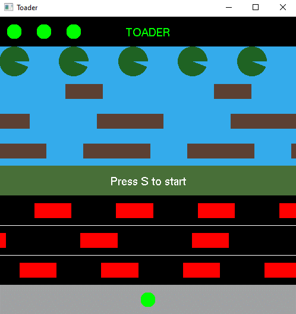
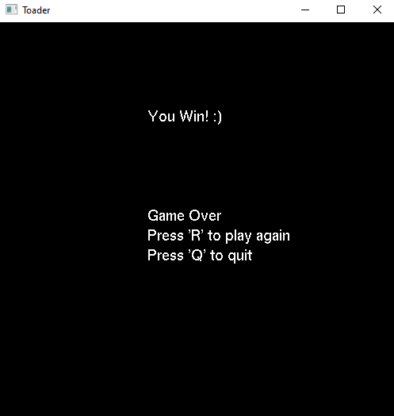
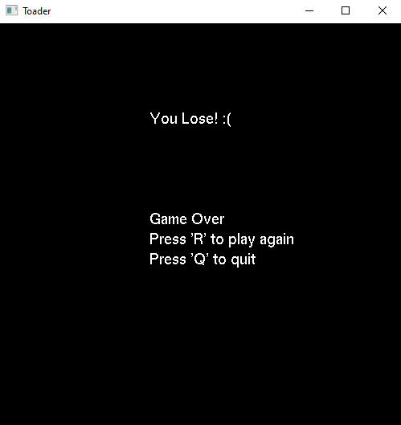

# Toader Game

## Table of Contents

- [Description](#description)
- [Features](#features)
- [Getting Started](#getting-started)
- [Game Controls](#game-controls)
- [How to Play](#how-to-play)
- [Collision Mechanics](#collision-mechanics)
- [Winning and Losing](#winning-and-losing)
## Description

Toader is a spinoff of the classic arcade game frogger where the player controls a frog and must safely guide it across various obstacles, such as roads and rivers, to reach the goal. The game includes features like lilypads and lives to enhance gameplay.

## Features

- Frog movement using arrow keys.
- Obstacle elements including roads and rivers.
- Lilypads for extra points.
- Lives system.
- Win and lose conditions.
- Start menu with game instructions.
- Replay and quit options.

## Getting Started

1. Make sure you have the required libraries and dependencies, including OpenGL, installed on your system.

2. Compile the game source code using your preferred C++ compiler. You can use a command like `g++ toader.cxx -lopengl32 -lfreeglut -lglu32` (or equivalent) to compile the code.

3. Run the game by executing the compiled binary. For example, run `./toader` in your terminal.

## Game Controls

- Use the arrow keys to control the frog's movement:
  - UP: Move the frog up.
  - DOWN: Move the frog down.
  - LEFT: Move the frog left.
  - RIGHT: Move the frog right.

- Keyboard shortcuts:
  - 'S': Start the game.
  - 'R': Restart the game.
  - 'Q': Quit the game.

## How to Play

1. Launch the game and start from the beginning or restart if you have lost.

2. Control the frog's movements using the arrow keys and navigate it across the game environment.

3. Avoid collisions with obstacles like cars on the roads and logs in the river.

4. Reach the goal area, usually at the top of the screen, to win the game.

5. Try to land on lilypads for extra points.

## Collision Mechanics

- The game employs collision detection to determine if the frog collides with various objects:
  - Roads: Collision occurs if the frog is hit by a vehicle.
  - Rivers: Collision occurs if the frog falls into the water without landing on a log or lilypad.
  - Lilypads: Landing on lilypads awards extra points.

## Winning and Losing

- To win the game, navigate the frog safely to each of the lilypads. Once each lilypad has been visited you win.
### Win Screen

### Lose Screen

- To lose the game, you may:
  - Get hit by a vehicle on the road.
  - Drown in the river without landing on a log or lilypad.

- The game offers multiple lives. Losing all lives results in a game over.

